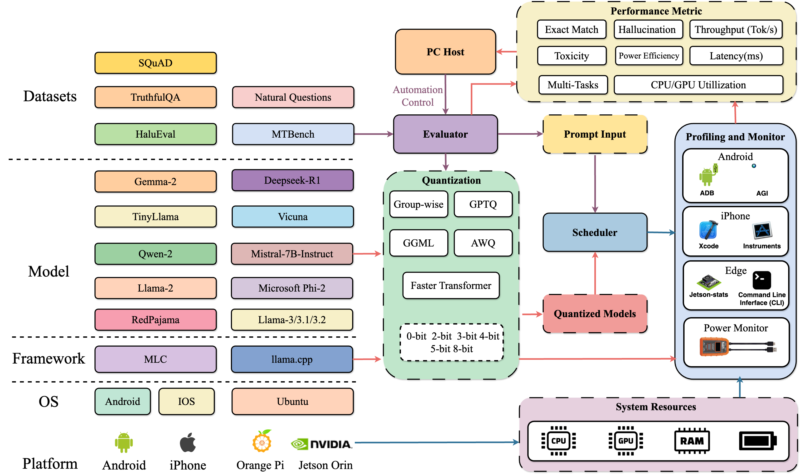

# PalmBench: A Comprehensive Benchmark of Compressed Large Language Models on Mobile Platforms

## Overview

**PalmBench** is a lightweight, all-in-one automated benchmarking framework designed to evaluate compressed **Large Language Models (LLMs)** on mobile devices. It provides comprehensive insights into resource efficiency, accuracy, and the impact of quantization on mobile LLM performance.

### 📌 Key Features:
- **Automated Benchmarking**: Evaluate LLMs with different quantization settings on mobile platforms.
- **Resource Efficiency Analysis**: Assess memory usage, GPU execution time, and power consumption.
- **Accuracy and Hallucination Study**: Measure performance degradation and analyze hallucination/toxicity trends in quantized models.

## 📖 Abstract

Deploying large language models (LLMs) locally on mobile devices is advantageous in scenarios where transmitting data to remote cloud servers is either undesirable due to **privacy concerns** or **impractical due to network constraints**. 

However, local deployment also presents challenges, particularly in balancing **quality (generative performance), latency, and throughput** within mobile hardware limitations.

**PalmBench** provides a **comprehensive benchmark** of various popular LLMs under different **quantization configurations** (both weights and activations) across multiple mobile platforms with varying hardware capabilities.

Unlike traditional benchmarks that assess full-scale models on high-end GPU clusters, **PalmBench** focuses on:
1. **Energy Efficiency & Throughput**: Differences in energy consumption and speed across mobile platforms.
2. **Quantization Impact**: Effect on memory usage, GPU execution time, and power consumption.
3. **Accuracy vs. Compression Trade-off**: Measuring performance degradation and evaluating hallucination & toxicity frequency in compressed LLMs.

## 🚀 Installation

On the way.....
